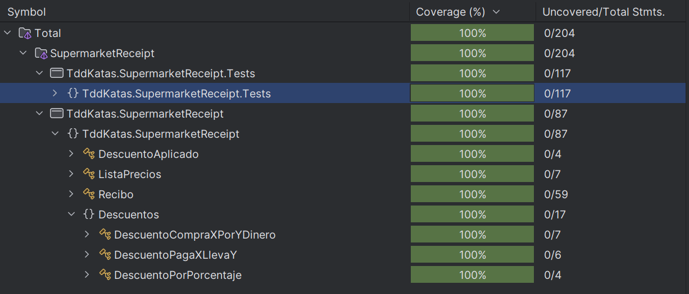

# TDD-katas

## Supermarket receipt

>Write some code that could be used in a supermarket to calculate the total cost of items in a shopping cart and provide a receipt to the customer.
>
>The supermarket has a catalog with different types of products (rice, apples, milk, toothbrushes,…). Each product has a price, and the total price of the shopping cart is the total of all the prices of the items. You get a receipt that details the items you’ve bought, the total price, and any discounts that were applied.
>
>The supermarket runs special deals, e.g.
>
>- Buy two toothbrushes, get one free. Normal toothbrush price is €0.99
>- 20% discount on apples, normal price €1.99 per kilo.
>- 10% discount on rice, normal price €2.49 per bag
>- Five tubes of toothpaste for €7.49, normal price €1.79
>- Two boxes of cherry tomatoes for €0.99, normal price €0.69 per box.
>- These are just examples: the actual special deals change each week.

Fuente: [Samman Technical Coaching](https://sammancoaching.org/kata_descriptions/supermarket_receipt.html)

La implementación realizada está únicamente enfocada en la creación del recibo. No se modeló el catálogo ni el shopping cart.

### Hallazgos

1. Realizar el assert contra el resultado final del recibo me permitió cambiar libremente la implementación en los refactorings sin tropiezos.
2. Mientras implementaba iba dejando TODO con las correcciones que esperaba poder realizar en el refactoring.
3. Disfruté mucho el refactor a partir de este [commit](https://github.com/augusto-romero-arango/TDD-katas/tree/4e932c22e23e173d1a02e598fcb6cdbcbb5cfcfe). Esta implementación estaba muy fea.
4. Refactorizar también es cumplir pequeños pasos y validar que estemos en verde. Para eso se debe evitar hacer cambios grandes que no permitan dejar retroalimetnación de la causa del error. Las pruebas funcionan como una malla de salvación.
5. Haga commits pequeños de cada refactor efectivo. Tuve momento en que un cambio que hice dañó el código y me tocó devolverme a un estado correcto conocido.
6. Después de segmentados los descuentos en clases, se podrían probar unitariamente cada descuento para evaluar casos de borde.
7. Sin estar pendiente del coverage. La solución tiene cobertura del 100% 

### Posibles continuaciones de la kata

- Implementar descuento de X% en la segunda unidad idéntica.
- Controlar que no se apliquen descuentos sobre descuentos en caso que un producto tenga más de un descuento.
- Implementar el catálogo de productos con precios.
- Implemnetar el carrito de compras.
- Modificar los descuentos para que sean aplicados masivamente y no por el ingreso individual de cada producto.

